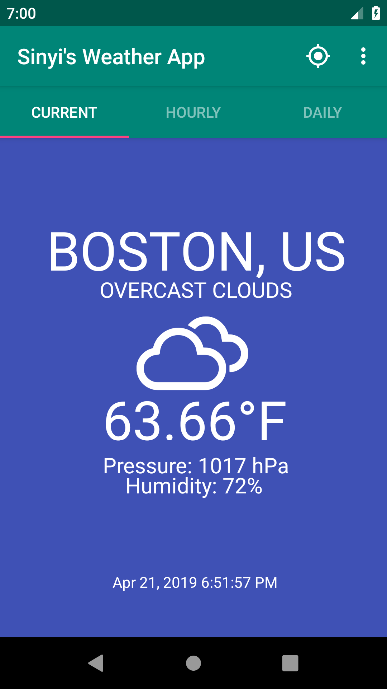
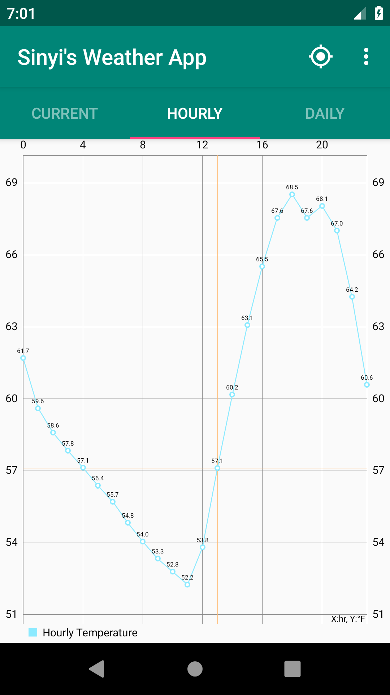
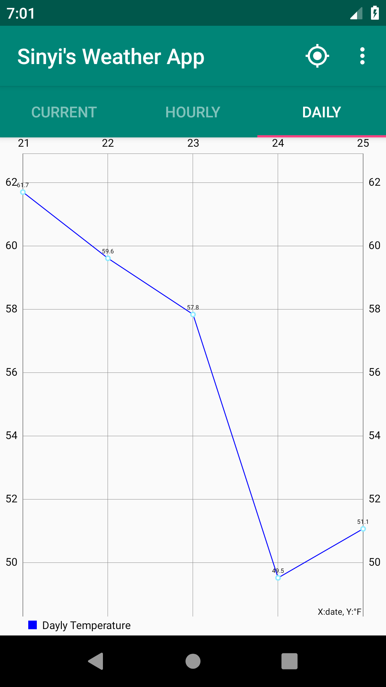
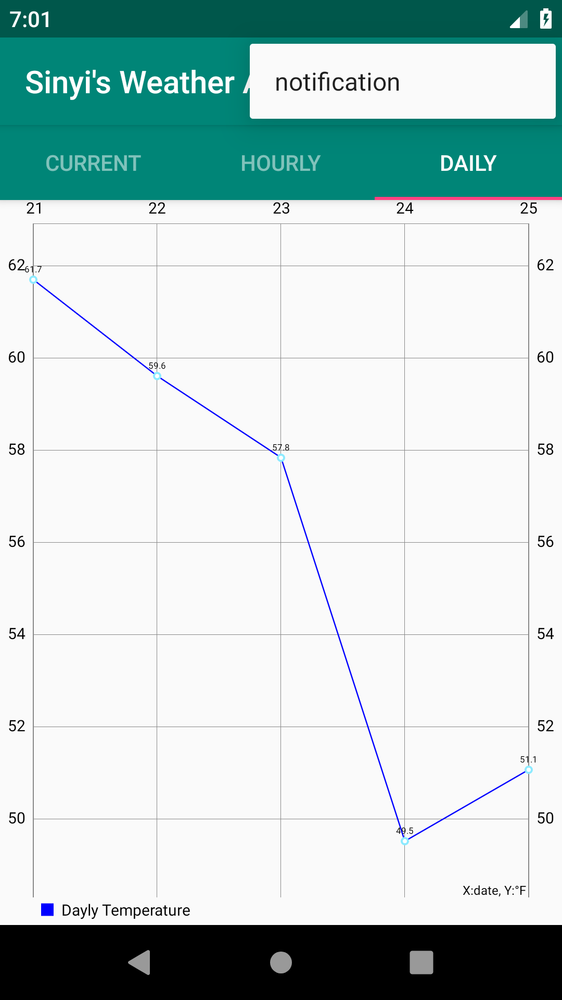
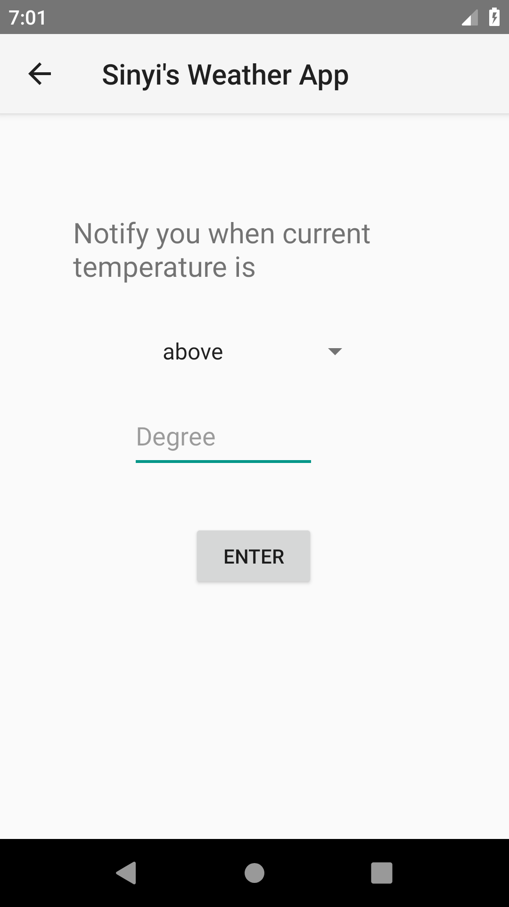
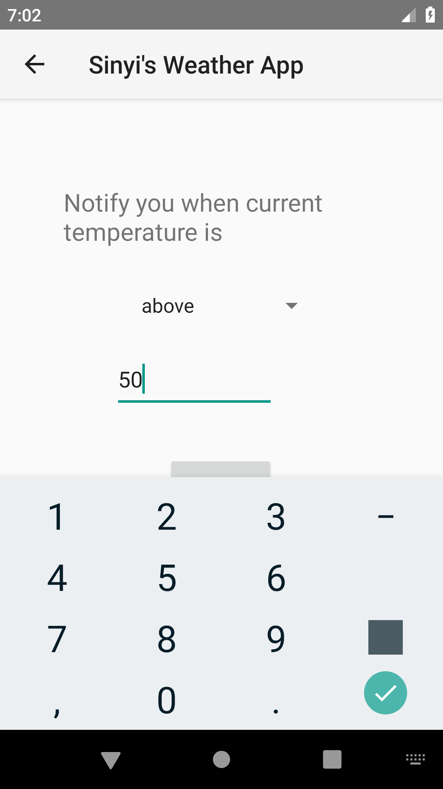

# weather-app-android

## Screenshots
    
  

## API key
Please modify the WEATHERMAP_API_KEY variable in MainActivity with your weather map api key.  
PATH: weatherAppTab/app/src/main/java/com/sinyi/weatherapptab/MainActivity.java  

## Compile
Please put this directory under your default Android Studio project directory.  
Please run it on API 28. 

## APK path
PATH: weather-app-android/apk/04212019/  

## Functions have built
- Show current temperature.
- Show hourly forecast(24hr).
- Show daily forecast(5 days).
- Can locate user location.
- Can set notifation(half finished)

## Functions haven't built
- Use user location, I am using hardcoded location:Boston right now. The problem is about FragmentPagerAdapter.
- Push notification.

## References
[Android Studio For Beginners Series](https://www.youtube.com/watch?v=dFlPARW5IX8&list=PLp9HFLVct_ZvMa7IVdQyUUyh8t2re9apm)  
[Create a Weather App on Android – Android Studio](https://youtu.be/w1g9AaDltUM)  
[Android options menu tutorial](https://youtu.be/EZ-sNN7UWFU)  
[Options Menu with Sub Items - Android Studio Tutorial](https://youtu.be/oh4YOj9VkVE)  
[Android Tab Tutorial -Android Studio Tab Fragments](https://youtu.be/bNpWGI_hGGg)  
[Tab Layout with Different Fragments - Android Studio Tutorial](https://youtu.be/h4HwU_ENXYM)  
[Get Location and City Name in Android Studio](https://youtu.be/rKnzzrdhb9g)  
[Notifications Tutorial Part 1 - NOTIFICATION CHANNELS - Android Studio Tutorial](https://youtu.be/tTbd1Mfi-Sk)  

[Modify tab style](https://materialdoc.com/components/tabs/)  
[Notifications Tutorial Part 1 - NOTIFICATION CHANNELS - Android Studio Tutorial](https://www.youtube.com/watch?v=tTbd1Mfi-Sk)  
[Repeat a task](https://stackoverflow.com/questions/6242268/repeat-a-task-with-a-time-delay)  
[Notifications](https://codinginflow.com/tutorials/android/notifications-notification-channels/part-1-notification-channels)   

## Other
- This project started on 4/17/2019, first version uploaded on 4/19/2019.
I will keep modify it.
- The forecast service of openweathermap will only support until5/1/2019.

##  Update history
### 4/21 Update note
- modify display
- built setting activity
- remaining problems: push notification & use user location(the notification function was successful before lol.. still trying to figure it out what was happened)